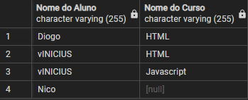
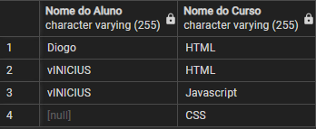
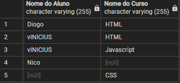
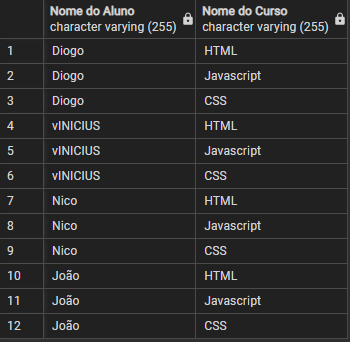

# PostgresSQL

**Comando para cria um Database**

    CREATE DATABASE <nomeDatabase>

**Para Lista os banco de dados criados**

    \l

**Para deletar um database**

    DROP DATABASE <nome>

## Criando uma tabela

**```integer``` -->  dados que são números inteiros entre -2147483648 e +2147483647**

**```real``` --> dados numéricos com casas decimais de até seis dígitos**

**```serial``` -->  números inteiros positivos com incremento automático, ou seja, não precisamos colocar o valor dele, pois quando incluirmos um novo dado, ele já será incrementado + 1**

**```numeric``` -->  com ele, poderemos definir a precisão, ou seja, a quantidade de casas decimais que queremos no número.**

#### Existem três tipos de campo de texto:

> - **O ```varchar(n)```, utilizado em 90% dos casos. Ele funciona para textos com um número de caracteres pré-determinado. Por exemplo: o nome de uma pessoa teria até, aproximadamente, 255 caracteres, portanto poderíamos caracterizá-lo como varchar;**

> - **O ```char(n)```, utilizado quando sabemos exatamente a quantidade de caracteres que será utilizada naquele campo. Por exemplo, o campo de CPF sempre vai ter 11 caracteres, então podemos colocá-lo em um campo do tipo char, que já tem o tamanho pré-definido. Porém, se foram definidos 11 caracteres para o campo e a pessoa preencheu apenas 9, os dois caracteres restantes serão preenchidos com espaços em branco, e não queremos isso. Por isso o este type só deve ser utilizado quando o dado tiver um número exato de caracteres;**
  
> - **O ```text```, utilizado quando não temos ideia de qual será o tamanho do texto, mas ainda queremos armazená-lo no banco de dados.**

**boolean** --> Ele é definido para ser verdadeiro ou falso, podendo ser utilizado quando só duas opções são possíveis: ativo ou inativo, se uma ação foi executada ou não e exemplos similares.

**date** --> Data

**time** --> Hora

**timestamp** -->  Apresenta tanto a data quanto a hora. Estes tipos de campo estão

**Criando tabela**
```sql
CREATE TABLE aluno (
	id SERIAL,
	nome VARCHAR(255),
	cpf CHAR(11),
	observacao TEXT,
	idade INTEGER,
	dinheiro NUMERIC(10, 2),
	altura REAL,
	ativo BOOLEAN,
	data_nascimento DATE,
	hora_aula TIME,
	matriculado_em TIMESTAMP
);
```

**Para os dados de minha tabela**

```sql
SELECT * FROM aluno;
```

# Executando operações CRUD

### Incluindo um egistro na tabela

```sql
INSERT INTO aluno (
	
	nome,
	cpf,
	observacao,
	idade,
	dinheiro,
	altura,
	ativo,
	data_nascimento,
	hora_aula,
	matriculado_em
	
) VALUES

(
	'Diogo',
	'12345678901',
	'Lorem ipsum dolor sit amet, consectetur adipiscing elit. Nulla ac dui et nisl vestibulum consequat. Integer vitae magna egestas, finibus libero dapibus, maximus magna. Fusce suscipit mi ut dui vestibulum, non vehicula felis fringilla. Vestibulum eget massa blandit, viverra quam non, convallis libero. Morbi ut nunc ligula. Duis tristique purus augue, nec sodales sem scelerisque dignissim. Sed vel rutrum mi. Nunc accumsan magna quis tempus rhoncus. Duis volutpat nulla a aliquet feugiat. Vestibulum rhoncus mi diam, eu consectetur sapien eleifend in. Donec sed facilisis velit. Duis tempus finibus venenatis. Mauris neque nisl, pulvinar eu volutpat eu, laoreet in massa. Quisque vestibulum eros ac tortor facilisis vulputate. Sed iaculis purus non sem tempus mollis. Curabitur felis lectus, aliquam id nunc ut, congue accumsan tellus.',
	35,
	100.50,
	1.81,
	TRUE,
	'1984-08-27',
	'17:30:00',
	'2020-02-08 12:32:45'
	
);

```

### Atualizando um registro na tabela

> **WHERE** - Sere para filtrar apenas os dados, básimante é lógica.

**Selecionar todos com filtragem pelo ID**

```sql
SELECT *
    FROM aluno
WHERE id = 1
```

```SET``` - Serve para informarmos os campos que modificamos
```UPDATE``` - Atualizar

### Excluindo um registro da tabela

**Verificando se um Nico na tabela**
```sql
SELECT * FROM aluno WHERE nome = 'Nico';
```

**Removendo registro, onde há um Nico**

```sql
DELETE FROM aluno WHERE nome = 'Nico';
```

## Consultas com Filtro

### Selecionando colunas específicas da tabela

```AS``` - É um alias, ou seja, serve para trocar o nome de exibição dos campos na tabela.

Se escrevermos ```SELECT matriculado_em AS quando_se_matriculou```, essa coluna aparecerá com o nome ```"quando_se_matriculou"```.

```sql
SELECT nome,
       idade,
       matriculado_em
FROM aluno;
```

O alias também pode ser usado para atribuir nomes com espaço para os campos, o que pode ser útil, por exemplo, para elaborar um relatório. Nesses casos, os novos nomes precisam estar entre aspas duplas ```" "```, ou o programa não irá reconhecê-los e aparecerá uma mensagem de erro de sintaxe.
```sql
SELECT nome AS "Nome do Aluno",
       idade,
       matriculado_em AS quando_se_matriculou
FROM aluno;
```


### Filtrando registros de campos do tipo texto

**Filtrando por igualdade**

```sql
SELECT * 
	FROM aluno
WHERE nome = 'Diogo';
```

**Filtrando por diferença**

```sql 
SELECT * 
	FROM aluno
WHERE nome <> 'Diogo'; 
```

**Ou**

```sql
SELECT * 
	FROM aluno
WHERE nome != 'Diogo';
```

**Filtrando com o Like**

```LIKE``` - Pode ser entendido como "parecido com".

***"ONDE nome PARECIDO COM 'Diogo'"***
```sql
SELECT *
	FROM aluno
WHERE nome LIKE 'Diogo';
```

Ao utilizarmos o **LIKE** podemos aplicar dois operadores especiais: o ``_`` (underline) e o ``%`` (porcentagem).

``_`` - "Qualquer caractere naquela posição", ou seja, a posição que ele ocupa substitui um caractere.

```sql
SELECT * 
	FROM aluno
WHERE nome LIKE '_iogo';
```

```sql
SELECT * 
	FROM aluno
WHERE nome LIKE 'Di_go';
```

**Não parece com**

```sql
SELECT * 
	FROM aluno
WHERE nome NOT LIKE '_iogo';
```

``%`` - substitui todos os caracteres até o espaço que ele ocupa.

para recuperar todos os nomes que comecem com "D", usamos o comando:
```sql
SELECT * 
    FROM aluno
 WHERE nome LIKE 'D%';
 ```
**Filtrar os nomes terminados em "s"**

```sql
SELECT * 
    FROM aluno
 WHERE nome LIKE '%s';
 ```

**Recuperar todos os nomes que tenham espaço**

```sql
SELECT * 
    FROM aluno
 WHERE nome LIKE '% %';
```

**Filtrar entre Textos**

```sql
SELECT * 
    FROM aluno
 WHERE nome LIKE '%i%a%';
```

###  Filtrando registros de campos do tipo numérico, data e booleano

**Filtrando valores Nulos atraves do IS**

```SQL

SELECT *
    FROM aluno
 WHERE cpf IS NULL;

```

``IS NOT`` -  É o comando oposto, ou seja, mostra todos os registros cujo campo selecionado está preenchido.

**>= , que filtra resultados maiores ou iguais ao valor que declaramos**

```SQL
SELECT *
	FROM aluno
WHERE idade >= 35;
```

``<=``
```sql
SELECT *
	FROM aluno
WHERE idade <= 35;
```
``>``

```sql
SELECT *
	FROM aluno
WHERE idade > 35;

```

``<``

```sql
SELECT *
	FROM aluno
WHERE idade < 35;
```

``BETWEEN`` - Procura resultados entre dois valores declarados.
```sql
SELECT *
    FROM aluno
 WHERE idade BETWEEN 10 AND 20;
```

Com esse exemplo também não teremos nenhum resultado retornado, porque 35 não está na faixa que definimos. Contudo, se trocarmos "20" por "35", o programa retornaria os dados do "Diogo" novamente, porque o BETWEEN é um comando inclusivo. Isso significa que ele começa a contar do menor valor declarado, ou seja, o "10", até o maior valor declarado, o "35". Sendo assim, os resultados que incluem esses números também aparecem na nossa busca.

Todos esses filtros que aprendemos agora funcionam para os campos **INTERGER, REAL, SERIAL, NUMERIC, DATE, TIME e TIMESTAMP**.

Já campo BOOLEAN usará apenas os filtros ``=`` e ``<>``.

```sql
SELECT * FROM aluno WHERE ativo = true;
```

```sql
SELECT * FROM aluno WHERE ativo = false;
```

**Para filtrar os resultados do campo boleano que sejam nulos**

```sql
SELECT * FROM aluno WHERE ativo IS NULL;
```


**Filtrando utilizando operadores E e OU**

``AND`` - E

```SQL
SELECT * 
	FROM aluno
WHERE nome LIKE 'D%'
	AND cpf IS NOT NULL;
```

```sql
SELECT *
	FROM aluno
WHERE nome LIKE '%Steppat'
	AND nome LIKE 'Nico%';
```

``OR`` - OU

```SQL
SELECT * 
	FROM aluno
WHERE nome LIKE 'Diogo'
	OR nome LIKE 'Rodrigo'
	OR nome LIKE 'Nico%';

```

```sql
SELECT * 
	FROM aluno
WHERE nome LIKE 'Thiago'
	OR nome LIKE 'Miguel';
```

### Resumo do modulo

- A selecionar campos específicos da tabela
- Como definir um alias para os nomes dos campos
- A filtrar registros, utilizando o WHERE para campos do tipo de texto
	- Operadores =, !=,<>, LIKE e NOT LIKE
	- A diferença entre = e LIKE
	- O funcionamento do caractere % no filtro com LIKE e NOT LIKE
	- O funcionamento do caractere _ no filtro com LIKE e NOT LIKE
- Como filtrar utilizando IS NULL e IS NOT NULL
- Como filtrar registros para campos do tipos relacionados a números, datas e horas
	- =, !=, <>, <, <=, >, >=
	- BETWEEN
- Como filtrar registros para campos do tipo booleano
  - =, !=, <>
- Como funciona os operadores lógicos AND e OR

## Trabalhando com relacionamentos

### Criando tabela com chave primária

**Chave primária** - "uma coluna, ou grupo de colunas, que pode ser usada para identificar uma linha da tabela".

```sql
CREATE TABLE curso (

	id INTEGER NOT NULL PRIMARY KEY,
	nome VARCHAR(255) NOT NULL

)
```
Uma chave primária não pode ser nula e precisa ser única.

### Criando uma tabela com chave estrangeira

```sql

FOREIGN KEY (CAMPO_NA_TABELA_ORIGEM)
REFERENCES TABELA_DESTINO (CAMPO_NA_TABELA DESTINO)

```
**Chave estrangeira** - uma limitação para especificar que o valor de uma coluna (ou múltiplas colunas) precisa corresponder a alguma linha de outra tabela.

A chave estrangeira bloqueia a entrada de um registro que não existe na tabela de destino, então usamos essa chave para evitar inconsistências no banco de dados.

**EX:**

```sql
CREATE TABLE aluno_curso (

	aluno_id INTEGER,
	curso_id INTEGER,
	PRIMARY KEY (aluno_id, curso_id),
	
	FOREIGN KEY (aluno_id)
		REFERENCES aluno (id),
	
	FOREIGN KEY (curso_id)
		REFERENCES curso (id)
	
);
```

### Consultas com relacionamentos

**JOIN** - Comando que une os dados existentes na tabela "A" com os dados existentes na tabela "B".

```sql
SELECT *
  FROM aluno
  JOIN aluno_curso ON aluno_curso.aluno_id = aluno.id

```


```sql
INSERT INTO aluno_curso (aluno_id, curso_id) VALUES (2, 2);
```


É possível informarmos na busca que queremos o retorno apenas dos nomes dos alunos e dos cursos, porém nas duas tabelas esses dados estão na coluna "nome", o que deixa a visualização dos resultados confusa. Portanto utilizaremos um alias para termos um retorno mais organizado.

```sql

SELECT aluno.nome as aluno,
       curso.nome as curso
  FROM aluno
  JOIN aluno_curso ON aluno_curso.aluno_id = aluno.id
  JOIN curso ON curso.id = aluno_curso.curso_id

```


Executando o código, notamos que agora a tabela especifica qual coluna tem os nomes de alunos e qual tem os nomes de cursos. Nosso código também funcionaria se escrevêssemos aluno.nome as aluno_nome, curso.nome as curso_nome ou, quando elaborarmos um relatório, com os nomes das colunas entre aspas.

```sql

SELECT aluno.nome as "Nome do Aluno",
       curso.nome as "Nome do Curso"
  FROM aluno
  JOIN aluno_curso ON aluno_curso.aluno_id = aluno.id
  JOIN curso ON curso.id = aluno_curso.curso_id

```

### LEFT, RIGHT, CROSS E FULL JOINS

**LEFT**
Retorna todos os registros da tabela esquerda e os registros correspondentes da tabela direita.

Para cada linha da tabela A, a consulta a compara com todas as linhas da tabela B. Se um par de linhas fizer com que a condição de junção seja avaliado como ``TRUE``, os valores da coluna dessas linhas serão combinados para formar uma nova linha que será incluída no conjunto de resultados.

Se uma linha da tabela **“esquerda” A** não tiver nenhuma linha correspondente da tabela **“direita” B**, a consulta irá combinar os valores da coluna da linha da tabela **“esquerda” A** com ``NULL`` para cada valor da coluna da tabela da **“direita” B** que não satisfaça a condição de junto (``FALSE``).

Em resumo, a cláusula ``LEFT JOIN`` retorna todas as linhas da tabela **“esquerda” A** e as linhas correspondentes ou valores ``NULL`` da tabela **“esquerda” A**.

```sql

SELECT aluno.nome as "Nome do Aluno",
	   curso.nome as "Nome do Curso"
	FROM aluno
LEFT JOIN aluno_curso ON aluno_curso.aluno_id = aluno.id
LEFT JOIN curso       ON curso.id             = aluno_curso.curso_id
```


**RIGHT**

Retorna todos os registros da tabela direita e os registros correspondentes da tabela esquerda.

A ``RIGHT JOIN`` combina dados de duas ou mais tabelas. A ``RIGHT JOIN`` começa a selecionar dados da tabela **“direita” B** e a corresponder às linhas da tabela **“esquerda” A**.

A ``RIGHT JOIN`` retorna um conjunto de resultados que inclui todas as linhas da tabela **“direita” B**, com ou sem linhas correspondentes na tabela **“esquerda” A**. Se uma linha na tabela **direita B** não tiver nenhuma linha correspondente da tabela **“esquerda” A**, a coluna da tabela **“esquerda” A** no conjunto de resultados será nula igualmente ao que acontece no LEFT JOIN.

```SQL

SELECT aluno.nome as "Nome do Aluno",
	   curso.nome as "Nome do Curso"
	FROM aluno
RIGHT JOIN aluno_curso ON aluno_curso.aluno_id = aluno.id
RIGHT JOIN curso       ON curso.id             = aluno_curso.curso_id
```


**FULL JOIN**

Retorna todos os registros quando houver uma correspondência na tabela esquerda ou direita.

A cláusula ``FULL JOIN`` retorna todas as linhas das tabelas unidas, correspondidas ou não, ou seja, você pode dizer que a ``FULL JOIN`` combina as funções da ``LEFT JOIN`` e da ``RIGHT JOIN``. ``FULL JOIN`` é um tipo de junção externa, por isso também é chamada junção externa completa.

Quando não existem linhas correspondentes para a linha da tabela esquerda, as colunas da tabela direita serão nulas. Da mesma forma, quando não existem linhas correspondentes para a linha da tabela direita, a coluna da tabela esquerda será nula.

```SQL

SELECT aluno.nome as "Nome do Aluno",
	   curso.nome as "Nome do Curso"
	  FROM aluno
FULL JOIN aluno_curso ON aluno_curso.aluno_id = aluno.id
FULL JOIN curso       ON curso.id             = aluno_curso.curso_id
```


**CROSS JOIN**

A cláusula **CROSS JOIN** retorna todas as linhas das tabelas por cruzamento, ou seja, para cada linha da tabela esquerda queremos todos os linhas da tabelas direita ou vice-versa. Ele também é chamado de produto cartesiano entre duas tabelas. Porém, para isso é preciso que ambas tenham o campo em comum, para que a ligação exista entre as duas tabelas.

Para entender melhor, pense que temos um banco de dado, onde temos uma tabela FUNCIONÁRIO e uma tabela CARGO, assim poderíamos ter vários cargos para um único FUNCIONÁRIO, e usando o **CROSS JOIN** podemos trazer todos os CARGOS de todos os FUNCIONÁRIOS.

```sql

SELECT aluno.nome as "Nome do Aluno",
	   curso.nome as "Nome do Curso"
	From aluno
CROSS JOIN curso;
```


### Resumo do módulo

- Como funciona a chave primária
- Como funciona os campos que aceitam ``NULL`` e que não aceitam ``NULL`` (``NOT NULL``)
- Como funciona um campo ``UNIQUE``
- Como criar uma chave primária
- Como funciona a chave estrangeira
- Como criar uma chave estrangeira
- Como criar consultas com relacionamentos
	- ``INNER JOIN``
	- ``LEFT JOIN``
	- ``RIGHT JOIN``
	- ``FULL JOIN``
	- ``CROSS JOIN``

## Usando CASCADE

#### DELETE CASCADE

Quando criamos a nossa ``FOREIGN KEY``, o padrão dela é o comando ``ON DELETE RETRICT``, ou seja, a chave estrangeira restringe o apagamento de dados que estão em duas tabelas. Ao trocarmos para ``ON DELETE CASCADE`` , sempre que apagarmos um dado de um banco, o registro será apagado de todas as tabelas que o contém, ou seja, quando apagarmos o dado do aluno, ele também será excluído do curso.

```SQL

CREATE TABLE aluno_curso (
    aluno_id INTEGER,
    curso_id INTEGER,
    PRIMARY KEY (aluno_id, curso_id),

    FOREIGN KEY (aluno_id),
     REFERENCES aluno (id),
     ON DELETE CASCADE

    FOREIGN KEY (curso_id),
     REFERENCES curso (id)

);
```

```SQL
DELETE FROM aluno WHERE id = 1;
```

#### UPDATE CASCADE

Assim como atualizamos com o comando DELETE CASCADE, adicionaremos o código UPDATE CASCADE , ou seja, quando alterarmos o dado em alguma tabela, ele também será alterado em todos os bancos relacionados entre si. Antes disso, apagaremos a tabela "aluno_curso" existente para executarmos o código a seguir.

```SQL

CREATE TABLE aluno_curso (
    aluno_id INTEGER,
        curso_id INTEGER,
        PRIMARY KEY (aluno_id, curso_id),

        FOREIGN KEY (aluno_id),
         REFERENCES aluno (id),
         ON DELETE CASCADE
         ON  UPDATE CASCADE

        FOREIGN KEY (curso_id),
         REFERENCES curso (id)

);

```

Com essa atualização, ao codarmos ``UPDATE aluno SET id = 20 WHERE id = 2`` teremos sucesso, e ao executarmos novamente a query, notaremos que o id do Vinícius mudou para "10". Escrevendo ``SELECT * FROM aluno_curso`` , notamos que a atualização do id também ocorreu na tabela "aluno_curso". Isso significa que com o comando ``UPDATE`` , ao atualizarmos a tabela "aluno", o dado também será alterado em "aluno_curso".

### Resumo do módulo

- Como funciona as restrições de chave estrangeira
- A diferença entre RESTRICT e CASCADE
- Como aplicar tipos diferentes de restrições de chave estrangeira no DELETE
	- RESTRICT
	- CASCADE
- A aplicar tipos diferentes de restrições de chave estrangeira no UPDATE
	- RESTRICT
	- CASCADE

## Avançando com consultas

#### Ordenando as consultas

``ORDER`` - Definir uma ordem
``DESC`` - Decrescente
``ASC`` - Crescente

```sql
-- Ordenando por nome de forma decrescente
SELECT * FROM funcionarios ORDER BY nome DESC;
-- Ordenando por nome e matricula de forma decrescente
SELECT * FROM funcionarios ORDER BY nome, matricula DESC;
-- Ordenando por posição na coluna
SELECT * FROM funcionarios ORDER BY 3, 4, 2;
-- Ordenando por posição, nome de forma decrescente e posição de forma crescente
SELECT * FROM funcionarios ORDER BY 4, nome DESC, 2 ASC;

-- Ordenando por nome da tabela aluno de forma decrescente e por nome da tabela curso.
SELECT 
	   aluno.id   as aluno_id,
	   aluno.nome as "Nome do Aluno",
	   curso.id   as curso_id,
	   curso.nome as "Nome do Curso"
	FROM aluno
	JOIN aluno_curso ON aluno_curso.aluno_id = aluno.id
	JOIN curso       ON curso.id             = aluno_curso.curso_id
	ORDER BY aluno.nome DESC, curso.nome
```
#### Limitando consultas

``LIMIT`` -  Para limitarmos o retorno.

```sql
SELECT *
	FROM funcionarios
	ORDER BY id
  LIMIT 5;
```

``OFFSET``:


Se precisarmos do retorno de dados que não estão no começo da tabela, ou seja, exibir o resultado após avançar algumas linhas.
 Essa cláusula pula a quantidade de linhas que estipularmos antes de exibir a busca, como podemos observar na simulação a seguir. Nela a ordenação será pelo "id" para visualizarmos melhor essa função.

```sql
SELECT *
	FROM funcionarios
	ORDER BY id
  LIMIT 5
OFFSET 3;
```
#### Funções de agregação

**As principais funções de agregação**


- ``COUNT`` - Retorna a quantidade de registros
- ``SUM`` -   Retorna a soma dos registros
- ``MAX`` -   Retorna o maior valor dos registos
- ``MIN`` -   Retorna o menor valor dos registros
- ``AVG`` -   Retorna a média dos registros

```sql
SELECT COUNT(id),
		SUM(id),
		MAX(id),
		MIN(id),
		AVG(id)
	FROM funcionarios;
```

#### Agrupando consultas

``DISTINCT`` -  Garante que os dados do campo solicitado não se repitam, a partir do agrupamento de informações.

```sql

SELECT DISTINCT
        nome
  FROM funcionarios
  ORDER BY nome;

SELECT DISTINCT
        nome,
        sobrenome
  FROM funcionarios
  ORDER BY nome;

```
``GROUP BY``- é um agrupamento para realização de buscas com funções de agregação. Em outras palavras, se o agrupamento da busca não precisar de agregação, realizamos com ``DISTINCT`` , do contrário, codaremos com ``GROUP BY`` .

```sql

SELECT
       nome,
       sobrenome,
       COUNT(*)
  FROM funcionarios
  GROUP BY nome, sobrenome
  ORDER BY nome;
```
Para entendermos melhor esse agrupamento, faremos simulações com as tabelas "aluno", "curso" e "aluno_curso", criadas nas últimas aulas. Nossa primeira situação será contar todos os cursos com alunos. Para isso, precisamos do retorno dessas tabelas.

```sql
SELECT *
    FROM aluno
    JOIN aluno_curso ON aluno.id = aluno_curso.aluno_id
    JOIN curso ON curso.id = aluno_curso.curso_id
```

Façamos uma nova busca que mostre os nomes dos cursos e a quantidade de alunos em cada um deles. Além disso, ordenaremos os dados pelo nome, informando a posição do campo.

```sql
SELECT curso.nome
        COUNT(aluno.id)
    FROM aluno
    JOIN aluno_curso ON aluno.id = aluno_curso.aluno_id
    JOIN curso ON curso.id = aluno_curso.curso_id
    GROUP BY 1
    ORDER BY 1
```

#### Filtrando consultas agrupadas

**Lembrete:** Sempre que aplicarmos um agrupamento na busca, é necessário codarmos o comando ``GROUP BY nome_ou_posição_do_campo`` .

```sql

SELECT *
        COUNT (aluno.id)
    FROM curso
    LEFT JOIN aluno_curso ON aluno.curso_id = curso.id
    LEFT JOIN aluno ON aluno.id = aluno_curso.aluno_id
GROUP BY 1

```

Os resultados mostram a quantidade de alunos por curso, sendo **"0"** em Javascript, **"1"** em CSS e **"2"** em HTML. Agora podemos filtrar esses dados. Aprendemos que os filtros utilizam ``WHERE`` , então escreveremos ``WHERE COUNT(aluno.id) = 0``.

```sql
SELECT *
    FROM curso
    LEFT JOIN aluno_curso ON aluno.curso_id = curso.id
    LEFT JOIN aluno ON aluno.id = aluno_curso.aluno_id
    WHERE COUNT(aluno.id) = 0
GROUP BY 1
```

Recebemos uma mensagem de erro com esse código. Isso aconteceu porque o **GROUP BY** utiliza funções de agrupamento que não funcionam com o **WHERE** . Se substituirmos no código **WHERE COUNT(aluno.id) = 0** por **WHERE nome.curso = 'Javascript'** , a tabela retorna o curso de Javascript e informa que tem zero alunos matriculados.

Entretanto, não queremos isso, porque nem sempre saberemos o curso sem alunos. Portanto, nosso filtro precisa ser com base na função de agrupamento.

**Logo, usaremos o HAVING**

``HAVING`` -  É utilizado quando há agregações
``WHERE`` - Nas outras ocasiões.

>**Dica:** Quando quiser adicionar um comentário no código do pgAdmin, utilize ``--`` . Dessa forma, a linha com esse sinal no começo não será lida durante a execução do código.

```SQL
SELECT curso.nome,
		COUNT(aluno.id)
	FROM curso
	LEFT JOIN aluno_curso ON aluno_curso.curso_id = curso.id
	LEFT JOIN aluno ON aluno.id = aluno_curso.aluno_id
	
	--WHERE curso.nome = 'Javascript'
GROUP BY 1
	HAVING COUNT(aluno.id) > 0;


--  listar os funcionários com nome duplicado
SELECT nome
    FROM funcionarios
    GROUP BY nome
    HAVING COUNT(id) > 1;

-- retorne o nome dos funcionários que aparecem apenas uma vez
SELECT nome,
		COUNT(id)
	FROM funcionarios
	GROUP BY nome
	HAVING COUNT(id) = 1;
-- retorne o nome dos funcionários que aparecem mais de uma vez
SELECT nome,
		COUNT(id)
	FROM funcionarios
	GROUP BY nome
	HAVING COUNT(id) > 1;

```

#### Resumo do modulo

- Como ordenar uma consulta
	- Ordenar utilizando os nomes de campo
	- Ordenar com mais de um campo
	- Ordenar por posição do campo
	- Ordenar por ordem Crescente e Decrescente
	- Ordenar com campos de tabelas diferentes
- Como limitar quantidade e paginar registros de consulta
	- ``LIMIT``
	- ``OFFSET``
- Como funcionam as funções de agregação
	- ``COUNT``
	- ``SUM``
	- ``MAX``
	- ``MIN``
	- ``AVG``
- Como funciona a função de arredondamento ``ROUND``
- Como funciona o agrupamento de dados
	- A diferença entre ``DISTINCT`` e ``GROUP BY``
	- Onde utilizar o ``DISTINCT``
	- Onde utilizar o ``GROUP BY``
	- Como utilizar o ``GROUP BY`` com os nomes de campo
	- Como utilizar o ``GROUP BY`` por posição
- Como funcionam os filtros por funções de agrupamento, utilizando ``HAVING``
	- A diferença entre ``WHERE`` e ``HAVING``
	- Como utilizar o ``HAVING``
